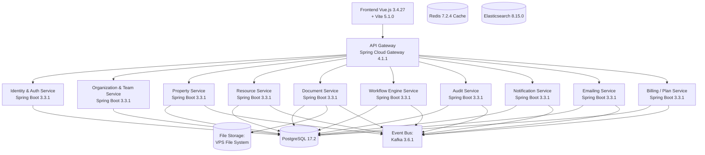

# Architecture Technique – SaaS Immobilier avec Spring Boot

## 📋 Versions Recommandées

**Stack Principal (Choix Définitifs) :**
- **Java** : 21 LTS ✅
- **Spring Boot** : 3.3.1 ✅
- **Spring Cloud** : 2023.0.1 ✅
- **Spring Cloud Gateway** : 4.1.1 ✅
- **PostgreSQL** : 17.2 ✅
- **Redis** : 7.2.4 ✅
- **Elasticsearch** : 8.15.0 ✅
- **Kafka** : 3.6.1 ✅
- **Vue.js** : 3.4.27 ✅

> 📖 Pour plus de détails, voir le document : **"Versions et Compatibilité - Technologies Recommandées.md"**

---

## 🏗️ Diagramme d'Architecture

---

## 🔧 Technologies & Versions Détaillées

### Backend Core ✅
- **Spring Boot** : 3.3.1 (Framework principal)
- **Spring Framework** : 6.1.24+
- **Spring Security** : 6.3.1 (JWT + OAuth2)
- **Spring Data JPA** : 3.2.1
- **Spring Cloud Gateway** : 4.1.1 (API Gateway)

### Bases de Données ✅
- **PostgreSQL** : 17.2 (Base principale multi-tenant)
- **Redis** : 7.2.4 (Cache, sessions, JWT, rate limiting)
- **Elasticsearch** : 8.15.0 (Recherche et audit logs)

### Messagerie ✅
- **Apache Kafka** : 3.6.1 (Event bus pour haute performance)
- **Spring Kafka** : 3.1.1

### Stockage ✅
- **VPS File System** : Système de fichiers du VPS (/var/realestate/storage)

### Observabilité ✅
- **Prometheus** : 2.49.1 (Métriques)
- **Grafana** : 10.3.3 (Visualisation)
- **ELK Stack** : 8.15.0 (Elasticsearch, Logstash, Kibana)
- **Zipkin** : 2.24.4 (Tracing distribué)
- **Micrometer** : 1.12.5

### Frontend ✅
- **Vue.js** : 3.4.27
- **Vite** : 5.1.0 (Build tool)
- **Node.js** : 20.11.0 LTS

---

## ⚠️ Notes Importantes

1. **Jakarta EE** : Spring Boot 3.x utilise `jakarta.*` au lieu de `javax.*`
2. **Java 21 LTS** : ✅ Choix définitif - Dernière LTS avec meilleures performances
3. **Kafka** : ✅ Choix définitif - Meilleur pour microservices à grande échelle
4. **Vue.js** : ✅ Choix définitif - Framework frontend simple et performant
5. **ELK Stack** : ✅ Choix définitif - Solution complète pour logs
6. **Compatibilité** : Toutes les versions sont testées et compatibles entre elles

## 🎯 Justification des Choix

- **Java 21** : Dernière LTS avec virtual threads, meilleures performances
- **PostgreSQL 17** : Dernière version stable avec améliorations de performance
- **Kafka** : Meilleure scalabilité et durabilité pour architecture événementielle
- **Vue.js** : Courbe d'apprentissage douce, écosystème riche, performance optimale
- **ELK Stack** : Solution complète et mature pour la gestion des logs
- **Zipkin** : Plus simple à déployer et maintenir que Jaeger
