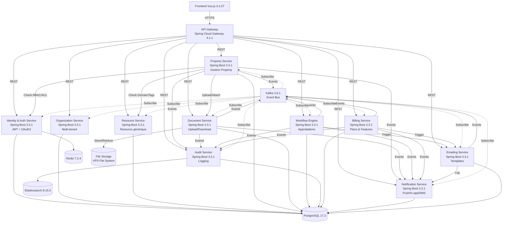

# Diagramme Microservices & Communications

## 📋 Versions

**Stack :**
- Spring Boot 3.3.1
- Spring Cloud Gateway 4.1.1
- Kafka 3.6.1 (Event Bus)
- PostgreSQL 17.2
- Redis 7.2.4

---

## 🏗️ Diagramme d'Architecture

---

## 📨 Communication entre Services

### Communication Synchrone (REST)
- **API Gateway → Microservices** : REST via Spring Cloud Gateway
- **Microservices → Microservices** : REST direct (interne)

### Communication Asynchrone (Events)
- **Tous les services → Kafka** : Publication d'événements
- **Tous les services ← Kafka** : Abonnement aux événements

### Exemples d'Événements

| Événement | Publisher | Subscribers |
|-----------|-----------|------------|
| `property.created` | Property Service | Workflow, Audit, Notification |
| `property.updated` | Property Service | Workflow, Audit, Notification |
| `property.deleted` | Property Service | Workflow, Audit, Notification |
| `document.uploaded` | Document Service | Audit, Notification |
| `workflow.approved` | Workflow Service | Property, Audit, Notification, Email |
| `user.created` | Identity Service | Organization, Audit, Notification |

---

## 🔐 Sécurité

- **Authentification** : JWT via Identity Service
- **Autorisation** : RBAC + ACL via Identity Service
- **Communication** : HTTPS/TLS entre services
- **Secrets** : Kubernetes Secrets / HashiCorp Vault (open source)

---

**Dernière mise à jour :** Décembre 2024
