# Architecture Microservices - Vue Détaillée

## 📋 Versions Recommandées

**Stack Principal (Choix Définitifs) :**
- **Java** : 21 LTS ✅
- **Spring Boot** : 3.3.1 ✅
- **Spring Cloud** : 2023.0.1 ✅
- **Spring Cloud Gateway** : 4.1.1 ✅
- **PostgreSQL** : 17.2 ✅
- **Redis** : 7.2.4 ✅
- **Elasticsearch** : 8.15.0 ✅
- **Kafka** : 3.6.1 ✅
- **Vue.js** : 3.4.27 ✅

> 📖 Voir **"Versions et Compatibilité - Technologies Recommandées.md"** pour les détails complets

---

## 🏗️ Diagramme d'Architecture

```mermaid
graph TD
    %% ========================
    %% FRONTEND / API GATEWAY
    %% ========================
    FGW[Frontend Vue.js 3.4.27<br/>API Gateway Spring Cloud Gateway 4.1.1]

    %% ========================
    %% IDENTITY & AUTH
    %% ========================
    ID[Identity & Auth Service<br/>Spring Boot 3.3.1<br/>Spring Security 6.3.1]
    ID_DB[(PostgreSQL 17.2<br/>Users, Roles, Permissions, RoleDelegation)]

    %% ========================
    %% ORGANIZATION & SETTINGS
    %% ========================
    ORG[Organization & Settings Service<br/>Spring Boot 3.3.1]
    ORG_DB[(PostgreSQL 17.2<br/>Organizations, Settings, Quotas, FeatureFlags)]

    %% ========================
    %% DOMAIN & RESOURCE
    %% ========================
    RES[Domain & Resource Service<br/>Spring Boot 3.3.1]
    RES_DB[(PostgreSQL 17.2<br/>Domains, Resource, ResourceAccess, Tags)]

    %% ========================
    %% PROPERTY SERVICE
    %% ========================
    PROP[Property Service<br/>Spring Boot 3.3.1]
    PROP_DB[(PostgreSQL 17.2<br/>Properties, PropertyAccess, Assigned Users/Teams)]

    %% ========================
    %% DOCUMENTS
    %% ========================
    DOC[Document Service<br/>Spring Boot 3.3.1]
    DOC_DB[(PostgreSQL 17.2<br/>PropertyDocuments, Media)]
    Storage[(File Storage:<br/>VPS File System)]

    %% ========================
    %% WORKFLOW
    %% ========================
    WF[Workflow Engine Service<br/>Spring Boot 3.3.1]
    WF_DB[(PostgreSQL 17.2<br/>ApprovalWorkflows, Tasks)]

    %% ========================
    %% AUDIT & LOGGING
    %% ========================
    AUD[Audit & Logging Service<br/>Spring Boot 3.3.1]
    AUD_DB[(PostgreSQL 17.2 + Elasticsearch 8.15.0<br/>AuditLog, Events)]

    %% ========================
    %% BILLING / SUBSCRIPTION
    %% ========================
    BILL[Billing Service<br/>Spring Boot 3.3.1]
    BILL_DB[(PostgreSQL 17.2<br/>Plans, Subscriptions)]

    %% ========================
    %% NOTIFICATIONS & EMAILING
    %% ========================
    NOTIF[Notification Service<br/>Spring Boot 3.3.1]
    EMAIL[Emailing Service<br/>Spring Boot 3.3.1]
    NOTIF_DB[(PostgreSQL 17.2<br/>Emails, SMS, Push)]
    EMAIL_DB[(PostgreSQL 17.2<br/>EmailTemplates, Logs)]

    %% ========================
    %% FLOW CONNECTIONS
    %% ========================

    %% FRONTEND -> Services
    FGW -->|Auth Token / Requests| ID
    FGW -->|API Calls| ORG
    FGW -->|API Calls| RES
    FGW -->|API Calls| PROP
    FGW -->|API Calls| DOC
    FGW -->|API Calls| BILL
    FGW -->|API Calls| WF
    FGW -->|API Calls| NOTIF
    FGW -->|API Calls| EMAIL

    %% PROPERTY SERVICE interactions
    PROP -->|Check RBAC / ACL| ID
    PROP -->|Check Domains & Tags| RES
    PROP -->|Emit Events| WF
    PROP -->|Emit Events| AUD
    PROP -->|Emit Events| NOTIF
    PROP -->|Upload / Attach Documents| DOC

    %% DOCUMENT SERVICE interactions
    DOC -->|Store / Retrieve Files| Storage
    DOC -->|Emit Events| AUD
    DOC -->|Emit Events| NOTIF

    %% RESOURCE SERVICE events
    RES -->|Emit Events| WF
    RES -->|Emit Events| AUD
    RES -->|Emit Events| NOTIF

    %% ORGANIZATION SERVICE events
    ORG -->|Emit Events| WF
    ORG -->|Emit Events| AUD
    ORG -->|Emit Events| NOTIF

    %% WORKFLOW interactions
    WF -->|Emit Events| AUD
    WF -->|Emit Events| NOTIF
    WF -->|Trigger Email| EMAIL

    %% BILLING interactions
    BILL -->|Emit Events| AUD
    BILL -->|Emit Events| NOTIF
    BILL -->|Trigger Email| EMAIL

    %% EMAIL interactions
    EMAIL -->|Send / Log| NOTIF
```

---

## 🔧 Technologies par Service

### Tous les Microservices ✅
- **Spring Boot** : 3.3.1
- **Java** : 21 LTS
- **Spring Framework** : 6.1.24+

### Bases de Données ✅
- **PostgreSQL** : 17.2 (tous les services)
- **Redis** : 7.2.4 (cache, sessions)
- **Elasticsearch** : 8.15.0 (Audit Service pour recherche)

### Communication ✅
- **Spring Cloud Gateway** : 4.1.1 (API Gateway)
- **Kafka** : 3.6.1 (Event Bus)
- **Spring Kafka** : 3.1.1

### Observabilité ✅
- **Prometheus** : 2.49.1 + **Grafana** : 10.3.3
- **Micrometer** : 1.12.5
- **ELK Stack** : 8.15.0 (Elasticsearch, Logstash, Kibana)
- **Zipkin** : 2.24.4

---

## ⚠️ Notes de Migration

1. **Jakarta EE** : Tous les packages `javax.*` doivent être remplacés par `jakarta.*`
2. **Java 21 LTS** : ✅ Choix définitif - Dernière LTS avec meilleures performances
3. **Spring Cloud 2023.0.1** : Compatible avec Spring Boot 3.3.1
4. **Kafka 3.6.1** : ✅ Choix définitif - Meilleur pour microservices à grande échelle
5. **Vue.js 3.4.27** : ✅ Choix définitif - Framework frontend simple et performant
